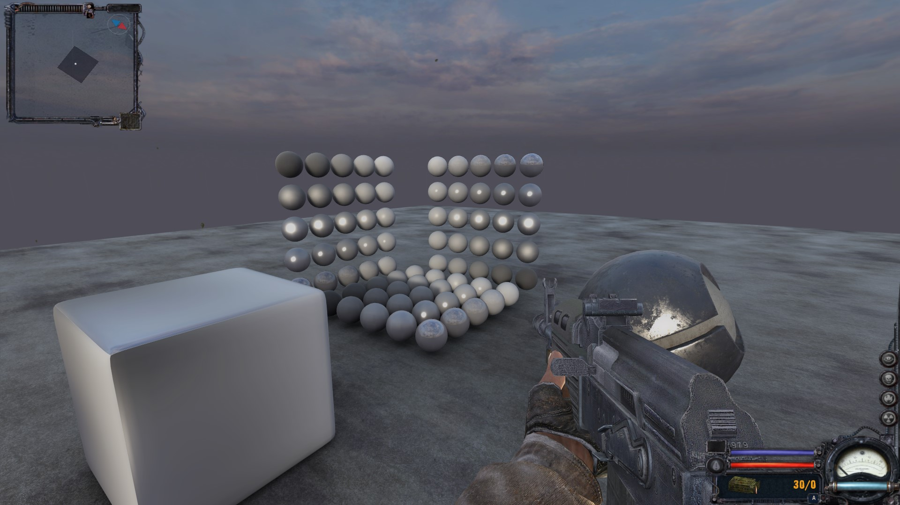
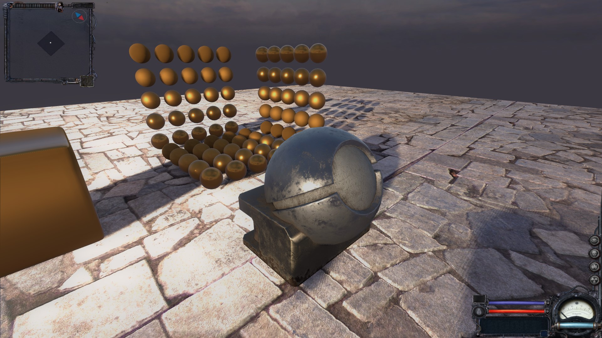

# ClearSkyPBS
A tiny PBS implementation for S.T.A.L.K.E.R. Clear Sky.

Tested on latest (1.5.10) patch.
Original shading is deprecated; along with texture layout. 

## Features
- Physically plausible GGX + Lambert model
- Filtered importance sampling for specular IBL
- Metallic - Roughness workflow

## Textures
I've decided to not complicate things with textures.
The format and layout is simple to understand:

| Name | Red | Green | Blue | Alpha|
|------|-----|-------|------|------|
| name.dds        | Albedo.r | Albedo.g | Albedo.b  | Alpha      |
| name_bump.dds   | Normal.x | Normal.y | Roughness | Metalness  |
| name_bump#.dds  | Empty    | Empty    | Empty     | Height map |

Layout for detail textures is the same. Alpha became a blending factor:
data = lerp(base_layer, detail_layer, detail_alpha);

You should use good DXT5 compressor, especially for _bump textures!

## G-Buffer
The following G-Buffer layout is used:

| Name | Red | Green | Blue | Alpha|
|------|-----|-------|------|------|
| s_position | Position.x | Position.y | Position.z | Roughness |
| s_normal   | Normal.x   | Normal.y   | Normal.z   |    AO     |
| s_diffuse  | Albedo.r   | Albedo.g   | Albedo.b   | Metalness |

## Screenshots

## Requirements
- PBR textures (see "Textures" section)
- DX10 renderer
- r3_gbuffer_opt set to off (you can do it in user.ltx file, or in console)

## Known issues
- Terrain shader is not converted to new texture format (To be done)

## Disclaimer
- This is a project done purely for fun. It does not implement advanced rendering techniques, nor aims to be the most accurate renderer ever.
- I've tried to cut corners everywhere, just to get somewhat physically plausible shading :) 
- There is no gamma correction, HDR, and proper tonemapping.
- For more informations see tinypbs.h

## Credits:
	- Michal Iwanicki & Angelo Pesce (DFG approximation)
	- xroo (Test map where I've been testing this shader)
	- Caesar (CS port of test map from xroo)
	- Blazej Kozlowski (Bunny ASCII art)

## References:
	- https://developer.nvidia.com/gpugems/gpugems3/part-iii-rendering/chapter-20-gpu-based-importance-sampling
	- http://miciwan.com/SIGGRAPH2015/course_notes_wip.pdf
	- https://graphicrants.blogspot.com/2013/08/specular-brdf-reference.html
	- https://schuttejoe.github.io/post/ggximportancesamplingpart1/
	- https://www.unrealengine.com/en-US/blog/physically-based-shading-on-mobile
